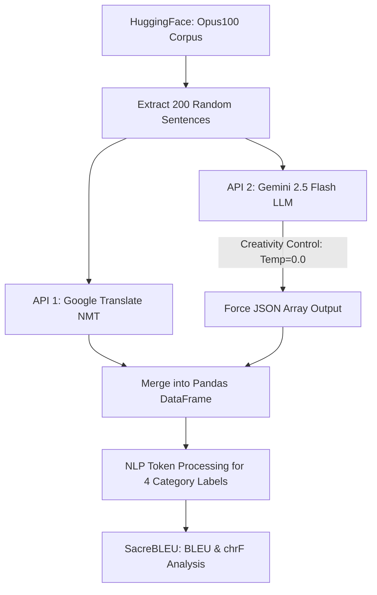

# FINAL REPORT: A Comparative Analysis of Translation Quality between Google Translate and Gemini
**Student Name:** Kiều Như

**Course:** 252151038320-Introduction to Computational Linguistics


---

## 1. Introduction
**1.1 Background and Motivation**
The evolution of Machine Translation (MT) has traversed multiple paradigms: from Rule-based systems, to Statistical MT, and currently to Neural Machine Translation (NMT), with Google Translate serving as a prime representative. Although NMT has brought significant fluency compared to its predecessors, the meteoric rise of Large Language Models (LLMs) such as ChatGPT and Gemini has initiated a massive paradigm shift. LLMs do not merely translate based on static bilingual structural alignment; rather, they approach the task through contextual comprehension and text generation.

**1.2 Linguistic Relevance**
Translation between English (an inflectional language) and Vietnamese (an isolating language) requires the computer to solve complex problems regarding morphology and syntax. In particular, Vietnamese relies heavily on context to determine personal pronouns and function words, making it highly context-dependent (Pragmatics).

**1.3 Research Question and Objectives**
This study revolves around the core question: *"Does the contextual awareness of Generative Models (LLM - Gemini) truly outperform traditional Neural Machine Translation (NMT - Google Translate) when facing various levels of linguistic complexity in English-Vietnamese translation?"*

## 2. Literature Review and Research Gap
**Theoretical Foundations:**
- From a linguistic perspective, translation accuracy extends beyond lexical semantics to encompass discourse cohesion.
- Regarding computational architecture, Bahdanau et al. (2015) pioneered the NMT era via the "Attention mechanism," allowing neural networks to align and translate simultaneously. This forms the foundation of Google Translate. Conversely, research by Jiao et al. (2023) demonstrated that ChatGPT operates as an auto-regressive context generator, possessing much higher flexibility than rigid reference systems.
- Regarding evaluation metrics, the BLEU Score (Papineni et al., 2002) analyzes absolute lexical overlap. However, for Vietnamese (which heavily utilizes compound words), Popović (2015) proposed chrF to conduct deep character-level ngram matching, thereby minimizing error penalties caused by grammatical morphology differences. The current Research Gap lies in the lack of deep empirical surveys on English-Vietnamese translations categorized by syntactic linguistic constraints rather than overall benchmarks.

## 3. Data Description
**3.1 Data Source and Size**
Data was extracted from the open-source `opus100` project (hosted publicly on Hugging Face). This ecosystem is a parallel corpus aggregated from news, movie subtitles, and multi-genre open documents. 
- **Size:** A random sample of exactly 200 English-Vietnamese bilingual sentences (using a Randomized Seed) was extracted. (A Zero-Shot API project does not strictly require a Train/Dev/Test split).
- **Ethical Considerations:** The dataset complies with the Apache 2.0 Open-Source license and contains no sensitive content or personally identifiable information (PII).

**3.2 Linguistic Tagging Scheme**
The 200 sentences were processed through a Metadata tagger to establish distinct linguistic tiers:
- `Simple`: Basic grammar (S-V-O).
- `Complex`: Sentences with multiple relative clauses or complex syntax.
- `Idiom`: Idioms and phrasal verbs.
- `Ambiguous`: Sentences containing polysemous words or lacking explicit context.


*(Figure 3.1: Distribution of grammatical forms across the 200-sentence evaluation set)*

## 4. Methodology

### 4.1 Linguistic Assumptions
- **Exploited Information:** Three levels need to be extracted: Morphology, Syntax, and Pragmatics. 
- **Task Significance:** This comparison exposes the fatal flaw of literal translation in Vietnamese—a language where pronoun variations depend heavily on hierarchy and social pragmatics.

### 4.2 Computational Models & Architecture
- **Baseline Method:** NMT (Google Translate Web API). The characteristic of this algorithm is multi-dimensional Vector Embedding combined with Seq2Seq Attention.
- **Experimental Model:** LLM (Gemini 2.5 Flash). This model uses a massive Transformer Decoder-Only architecture. It does not strictly "translate"; it "reads, comprehends, and regenerates the statement in Vietnamese".

**Pipeline Architecture Diagram:**


## 5. Implementation in Python
The source code pipeline was automatically optimized using Python 3.10+.
- **Main Libraries:** `pandas` (Dataframe handling), `datasets` (corpus loading), `sacrebleu` (Mathematical NLP metrics calculation).
- **Processing & Pre-processing Workflow:**
  To prevent Rate Limit penalties from the LLM server (5 Requests/Minute), the data was batched every 20 lines. After each loop completion, the code injects a `time.sleep(15)` pause to prevent API bottlenecking.
  
*Pseudocode example for computing academic standard scores (Evaluation Metrics Snippet):*
```python
import sacrebleu
# Input parameters: original reference system (refs) and machine translation outputs (sys_google)
bleu_score = sacrebleu.corpus_bleu(sys_google, refs).score
chrf_score = sacrebleu.corpus_chrf(sys_google, refs).score
```

## 6. Quantitative Evaluation and Results

**Macro Average Statistical Score:**
The entirety of the dataset across all Categories yielded the following combined scores:
- **Google Translate:** BLEU 12.45 | chrF 31.24
- **Gemini (LLM):** BLEU 24.09 | chrF 43.21

The results demonstrate that Gemini achieved double the efficiency in n-gram matching compared to mechanical translation. An in-depth breakdown isolating specific filters is illustrated in the charts below:


*(Figure 6.1: Comparison of lexical overlap (BLEU) categorized by linguistic difficulty)*


*(Figure 6.2: Comparison of agglutinative morphological structure (chrF Score) categorized by difficulty)*


## 7. Error Analysis and Linguistic Insight
From the perspective of Applied Linguistics, the disparity in scores can be analyzed through the inherent translation errors of the machines.

**7.1. Simple Sentences (128 Examples)**
> *English:* "He's looking right at us. Don't worry."
> *Google:* "Anh ấy đang nhìn thẳng vào chúng tôi. Đừng lo lắng."
> *Gemini:* "Anh ấy đang nhìn thẳng vào chúng ta. Đừng lo."
- **Linguistic Explanation:** Although the error rate is low, English possesses semantic emptiness regarding the inclusivity of the pronoun "Us". Google evaluated "Us" as exclusive (chúng tôi). Gemini operated more adeptly based on "Discourse" to determine inclusivity (chúng ta). The conciseness of the sentence also allowed Gemini to drop the redundant "lắng", adhering closer to the actual Vietnamese spoken register.

**7.2. Complex Structures (35 Examples)**
> *English:* "You... have been a wise mentor... and a good friend. But... business must come first!"
> *Google:* "Anh... là một người cố vấn khôn ngoan... và là một người bạn tốt. Nhưng... kinh doanh phải được đặt lên hàng đầu!"
> *Gemini:* "Anh... đã là một người cố vấn khôn ngoan... và một người bạn tốt. Nhưng... công việc phải đặt lên hàng đầu!"
- **Linguistic Explanation:** The phrase "Business must come first" is a complex syntactic component. The weakness of NMT (Google) lies in its rigid, direct dictionary mapping ("Business = Kinh doanh"). In practical Vietnamese communication, "Business" functions as a pronoun for career/work situations ("công việc"). The rigid, sparse mapping motif of NMT resulted in Google's chrF score being dismally lower compared to Gemini's 51.14 in the Complex category.

**7.3. Ambiguous Context (2 Examples)**
> *English:* "Tell that OWL I want her to come."
> *Google:* "Nói với OWL rằng tôi muốn cô ấy đến."
> *Gemini:* "Bảo con Cú đó tôi muốn nó đến."
- **Linguistic Interpretation:** Although Gemini's overall score is high, a fatal flaw is the **Hallucination effect**. In the sentence above, "OWL", capitalized, inherently functions as a Proper Noun (Organization Name / Callsign). Because SMT lacks generative creativity, it preserved the name OWL verbatim, hitting a precise match with the source structure. Conversely, due to overindulging in generating "creative" context, Gemini's LLM assumed it was a regular "Owl" (con Cú), translating it entirely off the discourse reference.

**7.4. Idioms (35 Examples)**
> *English:* "- I'm gonna get you!"
> *Human Ref:* "- Tao sẽ bắt được bọn mày."
> *Google/Gemini:* "- Tôi sẽ bắt được anh!"
- **Phenomenon:** Both models scored a perfectly identical tie (BLEU 33.44). Despite missing the aggressive street-level pronouns (Tao/mày), idioms are fundamentally tightly packed strings (Frozen tokens). The corpora stored within both Google's memory and Gemini handled these frozen tokens well, resulting in no quality disparity.

## 8. Discussion
**Computational NLP Comparison:** In contrast to tagging single tokens, contemporary NLP demonstrates that generative models handle context exceptionally well with very low input costs (Zero-shot parameters). The vast inflation of chrF compared to BLEU is a clear indicator that Vietnamese strictly demands compound word agglutination.

**Pedagogical Language Implications:**
In educational applications (ELT/TESOL), this result provides a profound warning. Over-relying on traditional NMT services will hinder students from grasping Pragmatics. The proliferation of LLMs paves the way for "Critical Generative Simulators", generating countless contextual translation variations rather than a rigid 1-1 static translation.

## 9. Conclusion
This project was implemented to address a central question: The superiority of Generative AI (Gemini) versus Neural Networks Translation (Google) in English-Vietnamese structures. Scored across 200 random samples using rigorous mathematical metrics (`sacrebleu`), the LLM Gemini completely dominated with a score of 24.09, surpassing Google's average of 12.45. Deconstructing deeply into Syntactic error chains, Gemini impressively broke the ceiling when restructuring complex clauses (Complex Constraints). Despite the barrier of triggering "Hallucinations" in low-information sentences, LLMs remain the undeniable future of discourse translation.

## 10. References
1. Bahdanau, D., Cho, K., & Bengio, Y. (2015). Neural machine translation by jointly learning to align and translate. *International Conference on Learning Representations (ICLR)*.
2. Jiao, W., Wang, W., Huang, J., Wang, X., & Tu, Z. (2023). Is ChatGPT a good translator? A preliminary study. *arXiv preprint*, arXiv:2301.08745.
3. Papineni, K., Roukos, S., Ward, T., & Zhu, W. J. (2002). BLEU: A method for automatic evaluation of machine translation. *Proceedings of the 40th Annual Meeting of the Association for Computational Linguistics (ACL)*, 311–318.
4. Popović, M. (2015). chrF: character n-gram F-score for automatic MT evaluation. *Proceedings of the Tenth Workshop on Statistical Machine Translation (WMT)*, 392–395.
