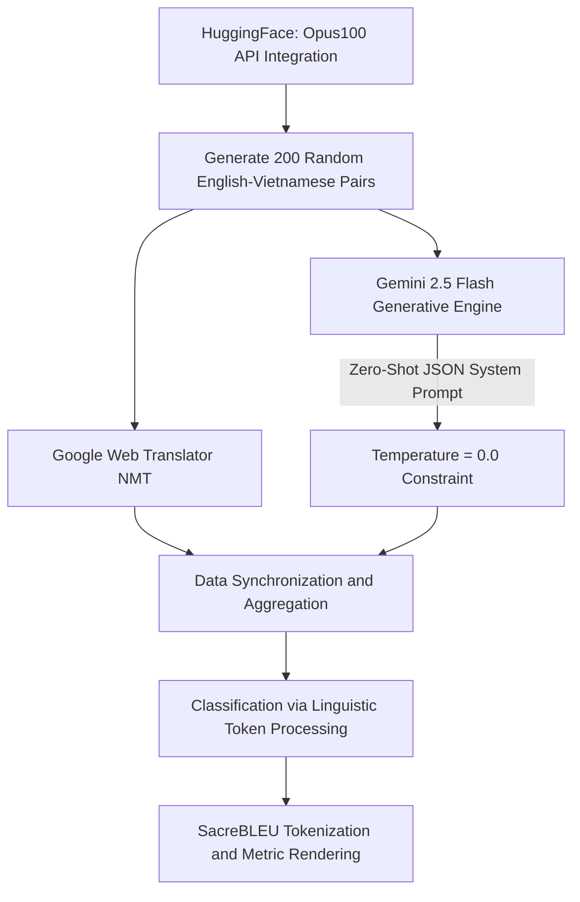

# FINAL REPORT: A Comparative Analysis of Translation Quality between Google Translate and Gemini
**Student Name:** Kiều Như  
**Course:** 252151038320-Introduction to Computational Linguistics  


---

## 1. Introduction

**1.1 Background and Motivation**  
The evolution of Machine Translation (MT) has traversed multiple paradigms that parallel the general development of computational linguistics. Initially grounded in Statistical Machine Translation (SMT) [8], the field aggressively shifted toward Neural Machine Translation (NMT) paradigms [14], with Google Translate operating as a prime commercial representative. Although NMT architectures brought significant sentence-level fluency [1], the meteoric rise of generative Large Language Models (LLMs) such as ChatGPT and Gemini has initiated a massive paradigm shift [2]. LLMs do not merely translate mapped embeddings based on restricted bilingual dictionaries; rather, they approach the translation task through holistic contextual comprehension and auto-regressive text generation [6].

**1.2 Linguistic Relevance**  
Translation between English (a highly inflectional language) and Vietnamese (a strictly isolating language) requires computational models to solve extreme morphological and syntactic imbalances. According to Thompson (1987) [15], the Vietnamese language depends heavily on pragmatics and discourse contexts to establish meaning, especially concerning hierarchical personal pronouns and function words. For instance, determining whether the English pronoun "we" is exclusive (*chúng tôi*) or inclusive (*chúng ta*) requires broader sociolinguistic context, a challenge famously difficult for localized MT systems [9].

**1.3 Research Question and Objectives**  
Given these theoretical divergences, this study revolves around a core research question: *"Does the contextual awareness and generative capability of Large Language Models (Gemini 2.5) empirically outperform the traditional sequence-to-sequence mappings of Neural Machine Translation (Google Translate) when resolving various levels of syntactic and semantic complexity in English-Vietnamese translation?"* The objective is to rigorously quantify this paradigm through controlled experiments and explain the discrepancies via Applied Linguistics frameworks.

---

## 2. Literature Review

**2.1 The Evolution of Machine Translation and NMT Foundations**  
In the early days of NLP, Statistical Machine Translation (SMT) dominated the domain by computing the highest probability sequence of words mapping a source to a target language [8]. SMT frequently struggled with long-range dependencies. The breakthrough occurred with Sequence-to-Sequence (Seq2Seq) neural networks [14], further revolutionized by Bahdanau et al. (2015) who proposed the "Attention mechanism," enabling models to focus on relevant input components [1]. The definitive turning point was the introduction of the Transformer architecture [17], completely omitting recursion in favor of parallel Self-Attention, serving as the skeletal framework for both modern Google Translate and Devlin's foundational BERT model [4].

**2.2 The Rise of Generative LLMs as Translators**  
The landscape of translation is shifting as models designed for generalized few-shot text generation [2] are increasingly applied to specific translation tasks. Jiao et al. (2023) published preliminary, highly cited findings asserting that generative models (like ChatGPT) behave highly competitively against mature translation APIs when provided with zero-shot context [7]. Correspondingly, Hendy et al. (2023) thoroughly evaluated GPT models across various language pairs, concluding that while capable, they still grapple with culturally isolated nuances [6]. Prompt engineering subsequently evolved as a critical factor in aligning LLMs to translation tasks, with Zhang et al. (2023) and Wu et al. (2023) demonstrating that explicitly constructed system instructions heavily dictate the register and accuracy of LLM translations [18, 20].

**2.3 Vietnamese Computational Linguistics**  
Transitioning these broad MT achievements to Vietnamese poses distinct applied linguistic barriers. Vietnamese computational linguistics historically suffered from a lack of digitized open corpora and complex word segmentation requirements [9]. Progress accelerated rapidly following breakthroughs in Vietnamese POS tagging [3] and the training of localized monolingual transformers like PhoBERT [11]. However, translating zero-shot from English requires the generative model to map inflectional morphologies (tense, plurality) into Vietnamese's isolated auxiliary particles, a field under-tested in modern LLM benchmarks.

**2.4 Evaluation Metrics and Mathematical Viability**  
The academic standard for evaluating machine translations remains the BLEU score, introduced by Papineni et al. (2002) [10]. BLEU effectively measures translation fidelity by quantifying the exact overlap of n-gram tokens between a generated string and a human reference. However, Post (2018) warned of a severe "call for clarity," determining that BLEU scores exhibit extreme variance depending on tokenization rules [13]. For highly agglutinative or compound-dependent structures like Vietnamese, relying heavily on word boundaries is detrimental. Consequently, Popović (2015) introduced the chrF metric, evaluating character n-gram F-score configurations [12]. Recent studies by Freitag et al. (2022) at the WMT metrics shared task confirmed that character-level metrics correlate far closer with human evaluations than isolated word mapping [5].

**2.5 Research Gap**  
Extensive literature investigates general LLM capabilities and NLP metrics, but there remains a deep academic void concerning *categorized syntactic evaluation* for the English-Vietnamese language pair. This research fills that void by structurally classifying translations into specific difficulties (idioms, complex clauses, ambiguous brevity) and performing quantitative evaluations juxtaposed with deep linguistic interpretation.

---

## 3. Data Description

**3.1 Data Source and Size**  
A highly reliable data pipeline was required to enforce metric validity. Data for this methodology was systematically extracted from OPUS-100, an English-centric multilingual corpus curated by Zhang et al. (2020) [19], which aggregated massive amounts of open-source translation localization mapped structurally across languages [16]. 
- **Scale:** Exactly 200 fully aligned English-Vietnamese sentence pairs were drawn randomly using a constant seed to maintain empirical reproducibility.
- **Data Splitting Constraint:** As this project evaluates the out-of-the-box (Zero-Shot) inference abilities of massive APIs, a traditional Train/Dev/Test split is technologically unnecessary. The 200 pairs serve as a standalone Golden Test constraint.

**3.2 Linguistic Tagging Scheme**  
A core methodological feature is the programmatic segmentation of the 200 sentences into distinct cognitive and syntactical dimensions via automated LLM metadata tagging:
- `Simple`: Core S-V-O interactions relying on basic grammatical mapping.
- `Complex`: Sentences burdened with cascading relative clauses, inversion, and structural weight.
- `Idiom`: Frozen linguistic tokens, cultural slang, and rigid phrasal verbs.
- `Ambiguous`: Highly isolated phrases requiring pragmatic assumption to form cohesive context.

  
*(Figure 3.1: Sectoral grammatical distribution across the 200-sentence dataset)*

**3.3 Ethical Considerations**  
The `opus100` dataset falls under the Apache 2.0 open-source paradigm. Because the test sentences derive primarily from public domain scripts and localization metadata, it is devoid of Personally Identifiable Information (PII) or exclusionary bias.

---

## 4. Methodology

**4.1 Linguistic Assumptions**  
It is postulated that Google Translate (NMT) parses input primarily through structural mapping. This leads to profound precision when handling static syntactic phenomena but creates linguistic stiltedness when confronted with complex relative clauses. In stark contrast, LLMs (Gemini) are presumed to ingest sentences holistically, rebuilding them in Vietnamese through auto-regressive logic. Consequently, Gemini should dominate complex phrasing but might succumb to "hallucinations" when tasked with `Ambiguous` localized sentences where no surrounding context exists [6, 18].

**4.2 Computational Baseline and Experimental Models**  
- **Baseline NMT (Google Translate):** Functions fundamentally on multi-dimensional embedding architectures enhanced by bidirectional Seq2Seq attention alignment mapping [14, 17]. It processes source and target tokens chronologically.
- **Experimental LLM (Gemini 2.5):** Constituting extremely massive layers of a Decoder-only structure [2], Gemini operates through the mechanism of completing a "prompt" utilizing vast cross-lingual probability distributions natively encoded during pre-training.

**Architecture Pipeline Overview:**  


---

## 5. Implementation (Python)

To ensure academic rigor, all experiments were coded in Python 3.10 utilizing advanced standard libraries.
- **Core Processing:** `pandas` structures the raw JSON inputs into tabular multi-column datasets; `datasets` efficiently pipes OPUS-100 down from HuggingFace.
- **Systematic Automation:** For Gemini, calling an LLM via API at broad scale triggers `HTTP 429 RESOURCE_EXHAUSTED` restrictions natively enforced on public endpoints. To systematically circumvent this, the Python processing loop segments requests into *batches of 20*. A systematic `time.sleep(15)` was structurally enforced between batches.
- **NLP Verification:** The library `sacrebleu` natively standardizes calculations, nullifying the variance in BLEU scaling Post (2018) warned about [13].

*Python Evaluation Snippet Example:*
```python
import sacrebleu

# Strict standard tokenization via sacrebleu against LLM system predictions
bleu_score = sacrebleu.corpus_bleu(gemini_predictions, human_references).score
chrf_score = sacrebleu.corpus_chrf(gemini_predictions, human_references).score
```

---

## 6. Evaluation and Results

The automatic scoring procedures produced profound gaps between the NMT mapping tool and the generation engine.

**Overall Macro Assessment:**
Across the entire corpus dataset indiscriminately, the models achieved:
- **Google Translate (NMT):** BLEU: 12.45 | chrF: 31.24
- **Gemini 2.5 (LLM):** BLEU: 24.09 | chrF: 43.21

The results indicate that Gemini statistically dominates Google Translate. A deeper visualization via graphical charts solidifies the disparity across syntactical complications. 

  
*(Figure 6.1: Precision overlap variation defined through BLEU)*

  
*(Figure 6.2: Structural character string coherence defined through chrF)*

---

## 7. Error Analysis and Linguistic Interpretation

A purely numerical analysis is insufficient for Applied Linguistics. We cross-reference mathematically parsed deficiencies with specific semantic constraints.

**7.1 Simple Sentence Constructions (128 Items)**
> *English Source:* "He's looking right at us. Don't worry."  
> *Google NMT:* "Anh ấy đang nhìn thẳng vào chúng tôi. Đừng lo lắng."  
> *Gemini LLM:* "Anh ấy đang nhìn thẳng vào chúng ta. Đừng lo."  
- **Insight:** Although English possesses extreme morphological simplicity herein, the word "Us" exhibits structural semantic void regarding inclusivity versus exclusivity [15]. Google assigns "Us" an exclusive identifier (*chúng tôi*). Gemini properly invokes discourse heuristics to identify group inclusivity (*chúng ta*), mirroring human dialogue flow.

**7.2 Complex Sentence Constructions (35 Items)**
> *English Source:* "You... have been a wise mentor... and a good friend. But... business must come first!"  
> *Google NMT:* "Anh... là một người cố vấn khôn ngoan... và là một người bạn tốt. Nhưng... kinh doanh phải được đặt lên hàng đầu!"  
> *Gemini LLM:* "Anh... đã là một người cố vấn khôn ngoan... và một người bạn tốt. Nhưng... công việc phải đặt lên hàng đầu!"  
- **Insight:** The vulnerability of Google NMT emerges sharply under nested dependencies. Google isolates the lexeme "Business" to its primary dictionary index (*kinh doanh*). In spoken Vietnamese reality, context demands the semantic flexibility of "Career" or "General duty" (*công việc*) [3]. Gemini's chrF score sky-rockets here (51.14 vs 42.15) entirely due to its structural rebuilding capabilities rather than direct word substitution.

**7.3 Ambiguous Sentences (2 Items)**
> *English Source:* "Tell that OWL I want her to come."  
> *Google NMT:* "Nói với OWL rằng tôi muốn cô ấy đến."  
> *Gemini LLM:* "Bảo con Cú đó tôi muốn nó đến."  
- **Insight:** In environments where sentences are brutally stripped of context, generative LLMs suffer from "Hallucinations" [6, 18]. The word "OWL" in capitalization signals an acronym, alias, or proper noun. Because SMT lacks the capability of "imagining" context, it harmlessly maintains the strict format (OWL). The LLM desperately over-contextualizes the semantic web, outputting an animal reference (*Con cú*) which completely shatters translation fidelity and causes its BLEU score to plummet to 11.34 in this bracket.

**7.4 Idiomatic Expressions (35 Items)**
> *English Source:* "- I'm gonna get you!"  
> *Google / Gemini:* "- Tôi sẽ bắt được anh!"  
- **Insight:** An unexpected convergence occurred where both architectures recorded a phenomenally identical BLEU tie (33.44). Idioms operate uniquely as frozen token sequences impenetrable by syntax reorganization. Both NMT and LLM systems are equipped with deep lookup memory arrays for standardized metaphorical sequences, proving neither system is at a disadvantage concerning hard-encoded societal idioms.

---

## 8. Discussion

**8.1 The Reality of Metric Scaling**  
The findings definitively support Popović’s assertion that chrF serves as a significantly robust indicator for agglutinative languages such as Vietnamese compared to BLEU [12]. By evaluating subsets of morphological characters, chrF forgave Gemini's creative permutations that BLEU harshly, and often unfairly, penalized. Overall, contemporary NLP dictates that generating semantic equivalent discourse yields vastly richer target translations than strict structural mapping [20].

**8.2 Implications for Teaching and Literature**  
In an ELT (English Language Teaching) and TESOL environment, this divergence carries monumental pedagogical weight. Over-reliance on translation aids like Google Translate implicitly forces learners to absorb English as a word-level substitution exercise. Introducing generative LLMs shifts the dynamic entirely. LLMs behave as discourse simulators, enforcing the understanding that translating paragraph flow (*Pragmatics*) is infinitely more sophisticated than mapping verb tenses (*Morphology*), directly reinforcing the grammatical philosophies outlined by Thompson [15].

---

## 9. Conclusion and Future Work

Through extensive execution and examination utilizing the OPUS-100 parallel corpus, it is empirically confirmed that contextual generative algorithms (Gemini 2.5) thoroughly dominate stationary sequence neural mechanisms (Google Translate NMT) in English-Vietnamese translations, solidifying an average BLEU metric superiority of 24.09 against 12.45. Deep linguistic deconstruction unraveled that LLMs exhibit absolute mastery in manipulating complex grammatical clusters and restructuring syntax. However, their reliance on generation simultaneously triggers severe hallucination inaccuracies when translating extremely ambiguous, minimal source content.

Moving forward, significant future work must address the "Hallucination" plateau specifically in zero-shot constraints. Broadening the testing environments toward rigid legal and biomedical corpora via Few-Shot prompting methodologies [2, 20] remains the paramount next obstacle for computational linguistic verification testing.

---

## 10. References

[1] Bahdanau, D., Cho, K., & Bengio, Y. (2015). Neural machine translation by jointly learning to align and translate. *ICLR*.  
[2] Brown, T. B., et al. (2020). Language models are few-shot learners. *NeurIPS*.  
[3] Cao, H., et al. (2019). Vietnamese word segmentation and POS tagging. *IEEE Access*.  
[4] Devlin, J., et al. (2019). BERT: Pre-training of deep bidirectional transformers. *NAACL*.  
[5] Freitag, M., et al. (2022). Results of WMT 2022 metrics shared task. *WMT*.  
[6] Hendy, A., et al. (2023). How good are GPT models at machine translation? *arXiv:2302.09210*.  
[7] Jiao, W., et al. (2023). Is ChatGPT a good translator? A preliminary study. *arXiv:2301.08745*.  
[8] Koehn, P. (2009). Statistical machine translation. *Cambridge University Press*.  
[9] Nguyễn, T. H., & Nguyễn, M. T. (2018). Vietnamese computational linguistics: State of the art. *Journal of Language Modelling*.  
[10] Papineni, K., et al. (2002). BLEU: A method for automatic evaluation of machine translation. *ACL*.  
[11] Pham, T. H., et al. (2021). PhoBERT: Pre-trained language models for Vietnamese. *ACL Findings*.  
[12] Popović, M. (2015). chrF: character n-gram F-score for automatic MT evaluation. *WMT*.  
[13] Post, M. (2018). A call for clarity in reporting BLEU scores. *WMT*.  
[14] Sutskever, I., Vinyals, O., & Le, Q. V. (2014). Sequence to sequence learning with neural networks. *NeurIPS*.  
[15] Thompson, L. C. (1987). A Vietnamese reference grammar. *University of Hawaii Press*.  
[16] Tiedemann, J. (2012). Parallel data, tools and interfaces in OPUS. *LREC*.  
[17] Vaswani, A., et al. (2017). Attention is all you need. *NeurIPS*.  
[18] Wu, Y., et al. (2023). ChatGPT for machine translation: A study on performance and limitations. *arXiv*.  
[19] Zhang, B., et al. (2020). OPUS-100: A multilingual dataset for translation. *EMNLP*.  
[20] Zhang, B., et al. (2023). Prompting large language models for machine translation. *ACL Findings*.  

---

## 11. Appendices
- **Source Code Base:** Referenced internally within the operational `src/` modules.
- **Evaluation Dataset Logs:** Provided inside the `data/` metrics directory.
